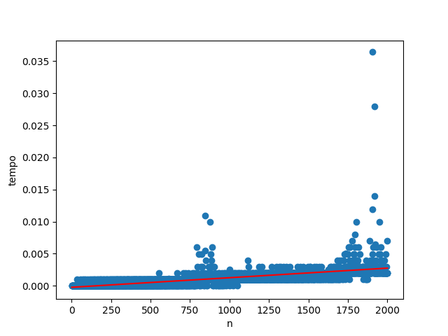

# LFA_AFD
Códigos para a disciplina de Linguagens Formais e Automatos, UFRB.

## 🔁 Trabalho 01 - Algoritmo Simulador de AFD 🔁

A entrada consiste da especificação de um AFD e de um conjunto de palavras. A saída consiste de uma lista indicando ‘S’ caso o AFD reconheça a palavra em questão e ‘N’ caso contrário.

`passoAFD` A função passo do AFD, funciona para realizar os passos do AFD, andando do passo atual para o próximo, e retornando estado de erro caso o ocd (origem, caractere e destino), não conversem com o estado atual.

```python 
def passoAFD(caractere, ocdLista, atual):
    for ocd in ocdLista:
        if(ocd[1]==caractere and atual[0]==ocd[0]):
            return ocd[2]
    return estadoErro()
```

`validaFinal` A função válida final recebe como parâmetro o estado atual e a lista de estados finais. Nela é então verificado se o estado que se encontra é final.

```python
def validaFinal(atual, finais):
    for final in finais:
        if(atual == final):
            return True
    return False 
```
    
`verificarPalavras` A função verificar palavras recebe um conjunto de palavras, o estado de início, a lista de tuplas ocd, e os finais válidos. Então para cada palavra são realizados os passos do afd e validado o estado final dele. Então após realizar o mesmo para todas as palavras é retornado uma lista com o estado da verificação de cada palavra.

```python
def verificarPalavras(palavras, inicio, ocdLista,finais):
    verificacao = []
    for palavra in palavras:
        atual = inicio
        for caractere in palavra:
            atual = passoAFD(caractere, ocdLista, atual)
        verificacao.append(validaFinal(atual, finais))
    return verificacao
```
## 🔁 Trabalho 02 - Algoritmo Simulador de ANFD 🔁

A entrada consiste da especificação de um AFND e de um conjunto de palavras. A saída consiste de uma lista indicando ‘S’ caso o AFD reconheça a palavra em questão e ‘N’ caso contrário.


`validaFinal` A função válida final recebe como parâmetro uma listas de estados que a linguagem chegou e a lista de estados finais bpalidos. Nela é então verificado se o estado que se encontra é final. Diferente da anterior, agora o ANFD possui diferentes finais, por isso é tratado como lista. 

```python
def validaFinal(atuais, finais):
    for final in finais:
        for atual in atuais:
            if(atual == final):
                return True
    return False
```
    
`verificarPalavras` A função verificar palavras recebe um conjunto de palavras, o estado de início, o hash de tuplas ocd, e os finais válidos. Então para cada palavra são realizados os possiveis destinos do afnd então validado o estado final dele. Após realizar o mesmo para todas as palavras é retornado uma lista com o estado da verificação de cada palavra.

```python
def verificarPalavras(palavras, inicial, ocdHash,finalValido):
    verificacao = []
    for palavra in palavras:
        atual = [inicial]
        for caractere in palavra:
            destinos = []
            for i in atual:
                if(ocdHash[i].get(caractere)):
                    for j in range(0,len(ocdHash[i][caractere])):
                        if(ocdHash[i][caractere] not in destinos):
                            destinos.append(ocdHash[i][caractere][j])
            atual = destinos
        verificacao.append(validaFinal(atual, finalValido))
    return verificacao
```

`Estrutura de Dados` Para o automâto foi utilizado uma estrutura hash para guardar os possivéis destinos do AFND, otimizando o uso de processamento do código.

```python
    ocd = {}
    for estado in estados:
        ocd[estado] = {}
    
    for i in range(0,transicoes):
        o, c, d = input().split(" ")
        if c not in ocd[o]:
            ocd[o][c] = []
        ocd[o][c].append(d)
```

## 🔁 Trabalho 03 - Autômato de Pilha Não-Determinístico (APND) 🔁

#1- Introdução: O quê? Qual a importância?

As transições da máquina são baseadas no estado atual e no símbolo de entrada, e também do símbolo mais alto na pilha. Os símbolos mais inferiores na pilha não estão visíveis e não provocam efeitos imediatos. As ações da máquina incluem colocar símbolo na pilha, retirá-lo da pilha ou substituir o topo da pilha. Um autômato com pilha determinístico tem no máximo uma transição possível para uma mesma combinação de símbolo de entrada, estado e símbolo no topo da pilha. Isto é o que o difere de um autômato com pilha não determinístico.

#2- Projeto e Implementação do Algoritmo.

A entrada consiste da especificação de um APND e de um conjunto de palavras. A saída consiste de uma lista indicando ‘S’ caso o APND reconheça a
palavra em questão e ‘N’ caso contrário. A palavra vazia (λ) será indicada pelo caractere *.

#3- Metodologia: qual metodologia de software utilizada, como realizou testes, como controlou
versões.

Programa realizado em Python 3. Por se tratar de um algoritmo significamente pequeno, foram realizados apenas testes com palavras conhecidas e um teste com palavras aleatórias de 0 até um tamanho N. E o versionamento não-se fez nescessário pois não se espera manutenção e implementação futura.

`Estrutura de Dados` A pilha foi realizada pela estrutura de pilha do python e o APND em tabela hash.
#4- Resultados e Conclusões.

`verificarPalavras` A função verificar palavras recebe um conjunto de palavras, o estado de início, o hash de apnd, e os finais válidos. Então para cada palavra são realizados os possiveis destinos, mapeando todos os estados finais que são possíveis chegar, e então validando quando encontra um estado final válido nele. Após realizar o mesmo para todas as palavras é retornado uma lista com o estado da verificação de cada palavra.

```Python
def verificarPalavras(palavras, ini, apnd, fin):
    verificacao = []
    for palavra in palavras:
        current = [(ini, [], palavra)]
        check = False
        while check == False and len(palavra) > 0 and len(current) > 0:
            _est, _pil, _pal = current.pop()

            if apnd[_est].get('*') and _pal != '*':
                triplas = apnd[_est].get('*')
                for desempilha, estadoTo, empilha in triplas:
                    __pil = _pil.copy()
                    if desempilha != '*':
                        if len(__pil) == 0:
                            break
                        else:
                            topo = __pil.pop()
                            if desempilha != topo:
                                continue
                    if empilha != '*':
                        for element in empilha:
                            __pil.append(element)
                    current.append([estadoTo, __pil, _pal])
            if len(_pal) == 0:
                if _est in fin and len(_pil) == 0:
                    check = True
                else:
                    continue
            palavraTemp2 = _pal[1:]
            if apnd[_est].get(_pal[0]):
                triplas = apnd[_est].get(_pal[0])
                for desempilha, estadoTo, empilha in triplas:
                    pilhaTemporaria = _pil.copy()
                    if desempilha != '*':
                        if len(pilhaTemporaria) == 0:
                            break
                        else:
                            topo = pilhaTemporaria.pop()
                            if desempilha != topo:
                                continue
                    if empilha != '*':
                        for element in empilha:
                            pilhaTemporaria.append(element)
                    current.append([estadoTo, pilhaTemporaria, palavraTemp2])
        verificacao.append(check)
    return verificacao

```

Resultados 

`Tempo de Verificação` Foi possível verificar com exito se a palavra era ou não pertencente ao APND. Para comparação de tempo de resposta foi utilizado a seguinte estrutura para realizar diversas execuções do programa com diversas palavras em tamanho crescente. E então com marcações de tempo no código foi verificado o quanto aumenta o tempo de execução com o aumento da palavra.

```Python
    #Algoritmo geração de palavras, sendo tam o tamanho dela e qua a quantidade.
        palavras = []
    for _quan in range (0,qua):
        palavra = ""
        for _tam in range (0,tam):
            palavra = palavra + alfabeto[(random.randint(0,1))]
        palavras.append(palavra)
```
Para testes com palavras de 0 até tamanho 20.000 foi obtida a seguinte equação, por regressão linear, para resultado de processamento: y = 9.428167954361586e-07x + 3.1401160599411936e-05
O código foi rodado várias vezes de acordo o seguinte segmento: 

```Python
tempos = []
for i in range(0,2000):
    
        timeIni = time.time()*10000
        (inicio(1,i)) #roda o codigo
        timeFin = time.time()*10000
        timef = timeFin - timeIni
        t1.append(timef/10000)


lr = LinearRegression()
x = np.array(list(zip(range(1,2001))))
y = np.array(tempos)
lr.fit(x,y)
plt.xlabel('n')
plt.ylabel('tempo')
plt.scatter(x, tempos)
plt.plot(x, lr.predict(x), color='red')
plt.show()
```
O processamento foi eficiente, sem apresentar crescimento significativos para o tamanho da imagem. Lembrando que o tempo está em ms. 



